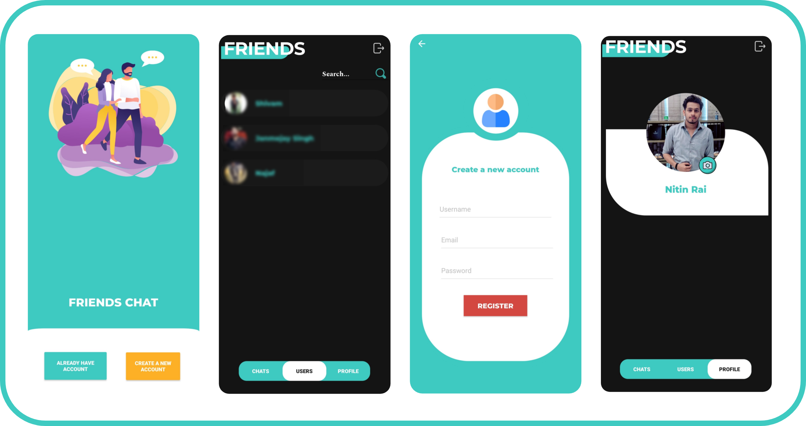

# FRIENDS
> A simple android chat app with minimal design.

FRIENDS is a project that I started to improve my Android Development knowledge.
Later on I have decided to make it public and open source.

It uses Firebase's Authentication/Database/Storage/Messaging/CrashReporting libraries for it's implementation
and several other libraries.



## Installation
```sh
*Setting up project*

- Download Project
- Create a new [Firebase](https://firebase.google.com) Project in console
- Connect project with Firebase `(Tools/Firebase)` in Android Studio
- Generate, download, paste `google-services.json` into the project

```

## Upcoming

- Blocking
  - Block user from sending messages
  
  
## Download [App](https://labs.xda-developers.com/store/app/com.dvlnitins.friends)

